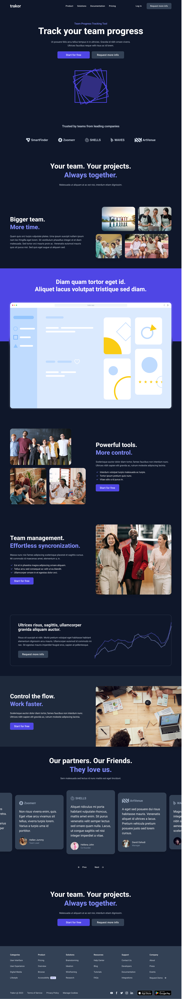

# 🚀 Trakor – Landing Page Moderna & Responsiva


**Troker** é uma landing page fictícia, responsiva e moderna, criada com foco em performance, animações suaves e código limpo. Desenvolvida em **React** com **Vite**, estilizada com **Tailwind CSS**, animada com **Framer Motion** e com carrossel interativo usando **Swiper**.

> 💡 Todos os textos são fictícios e o layout foi inspirado em um projeto no Figma.

---

## 🧪 Tecnologias Utilizadas

- ⚛️ [React.js](https://reactjs.org/)
- ⚡ [Vite](https://vitejs.dev/)
- 🎨 [Tailwind CSS](https://tailwindcss.com/)
- 🌀 [Framer Motion](https://www.framer.com/motion/) – para animações suaves
- 🖼️ [Swiper](https://swiperjs.com/react) – carrossel responsivo
- 🔥 [React Icons](https://react-icons.github.io/react-icons)

---

## 📸 Demonstração



> A interface se adapta perfeitamente a dispositivos móveis, tablets e desktops.

---

## ✨ Funcionalidades

- Layout 100% responsivo (Mobile-First)
- Carrossel com navegação interativa (Swiper)
- Animações de entrada com Framer Motion
- Design inspirado em interface do Figma
- Ícones integrados via React Icons
- Estilização com Tailwind CSS
- Estrutura modular e escalável

---

## ▶️ Como rodar o projeto localmente

1. Clone este repositório:

```bash
git clone https://github.com/luizjose/trakor-lp.git
```

2. Instale as dependências:

```bash
npm run dev
```

3. Acesse no navegador: 
[Acesse via navegador](http://localhost:5173)

📌 Observações

- Página desenvolvida apenas com foco no Frontend.

- Layout baseado em protótipo do Figma (não incluído no repositório).

- Pode ser utilizada como base para landing pages de SaaS, produtos ou portfólios.